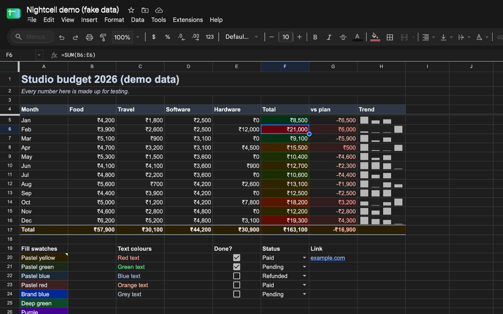

# Nightcell: a real dark mode for Google Sheets

Google Sheets on the web still has no dark mode. The extensions that try to add one mostly
slap `filter: invert(1)` on the page, so your cell colours turn into their opposites, images go
negative, charts look radioactive, and the grid flashes white every time it redraws.

Nightcell paints the dark theme **inside the grid's canvas**. Every colour Sheets draws is
swapped for a dark-theme version at the moment it is drawn, and the hue is kept: a pastel
yellow row becomes a deep amber row, red negatives stay red, and text is lifted until it is
readable on whatever cell it sits on.

**Site and download:** [nightcell-sheets.vercel.app](https://nightcell-sheets.vercel.app)

<p align="center">
  
</p>

## What you get

| | |
|---|---|
| **Grid** | Cell fills keep their hue in a dark band. Text is lifted per colour, so every fill/text pair we test stays at 5:1 contrast or better in all four themes (see Tests). |
| **Your colours** | Conditional-format scales, banding, colour-coded text, checkboxes, dropdown chips and sparklines all stay distinguishable. |
| **Charts** | Backgrounds and labels go dark; series colours are kept as you chose them (or adapt them, your call). |
| **Everything else** | Menus, toolbar, formula bar, sheet tabs, dialogs, sidebars, tooltips, comments. A safety net darkens any new pop-up Google ships before the stylesheet knows it. |
| **Four themes** | Graphite (neutral), Midnight (blue-black), OLED (true black), Dim (soft grey). |
| **Your font** | Type any font installed on your computer into the popup. Cells, charts, menus and dialogs use it on your screen; monospace cells keep theirs, and the file never changes. |
| **Per sheet** | Keep one sheet light while the rest go dark, or follow your computer's appearance. |
| **Shortcut** | `Alt+Shift+D` toggles. No reload. |
| **Private** | No analytics, no network requests, no access to your cell data. One permission: `storage`, for your settings. |

## Install (local, while it is in review)

1. Download [nightcell.zip](https://nightcell-sheets.vercel.app/nightcell.zip) and unzip it
   (or clone this repo and use its `extension` folder).
2. Open `chrome://extensions` and switch on **Developer mode** (top right).
3. Click **Load unpacked** and choose the unzipped `nightcell` folder.
4. Open any Google Sheet. It is dark already. Pin the moon icon from Chrome's puzzle-piece menu
   to reach the settings.

Built for Chrome 111+ and tested in Chrome. Other Chromium browsers with Manifest V3 main-world
content scripts (Edge, Brave, Arc, Vivaldi) load it the same way.

## How it works

```
document_start ─┬─ font.js + engine.js       wraps CanvasRenderingContext2D draw calls (page world)
                │                            fillRect / fill / fillText / stroke
                │                            colour -> OKLCH -> dark-theme colour -> draw -> restore
                ├─ ui.css                    Google's own UI, scoped to html[data-nightcell="on"]
                └─ bridge.js (isolated)      settings from chrome.storage, mirrored to the page so
                                             the next load is dark from the first frame
background.js                                Alt+Shift+D, and a 1% zoom nudge to repaint the canvas
```

- **Roles, not inversion.** A colour means different things depending on what is drawn with it.
  `fillRect` is a cell background, `fillText` is ink, `stroke` and hairline rects are grid lines,
  and a coloured rect shorter than the row is a data mark (a sparkline bar). Each role has its
  own mapping in OKLCH, so lightness flips where it should and hue never does.
- **Two policies.** The cell grid adapts every colour. Charts and unknown canvases only flip
  neutrals (white backgrounds, grey labels), so your series colours stay yours.
- **No flash of white.** Settings are mirrored into the page's localStorage, so the engine knows
  your theme synchronously at `document_start`, before Sheets paints anything.
- **Repaint without reload.** Sheets only redraws its canvas on a real resize, so a theme change
  nudges the tab zoom by 1% and back (Sheets' own zoom box is the fallback).
- **Your font, two routes.** Canvas text gets the chosen family put first in every font Sheets
  sets, and Sheets measures with that same font, so column widths and overflow hold. The interface
  gets font faces named Roboto, Google Sans and Arial whose source is `local()`, the copy installed
  on your computer, so Google's own styles never change. Which weights are installed is checked one
  name at a time with the FontFace API; Nightcell never lists your fonts and bundles none.

## Tests

```bash
node --test test/engine.test.mjs                               # colour maths, contrast, fonts
node test/e2e/run.mjs <chrome-binary> <puppeteer-core-dir>     # the packaged extension, end to end
```

The contrast test maps 20 common fills against 9 common text colours (180 pairs, including
Sheets' own header blues and banding greys) in each of the four themes, and fails if any pair
drops below 5:1 (WCAG AA asks for 4.5:1). Current minimums: Graphite 5.34, Midnight 5.11,
OLED 7.36, Dim 5.20. The weakest pair is red text on a dark green fill, which reads at 1.5:1 in
light mode.

The end-to-end test loads the real extension into Chrome for Testing against a local mock of
the Sheets page and checks 32 things: the first paint is already dark, grid and chart colours,
dark fills that stay dark after frozen-row repaints, the toolbar stylesheet, the safety net (an
unknown light pop-up and its hairlines, a 5,000-node sidebar, tinted chips, hover states, text
that fades in), switching theme from the popup (with repaint and zoom restored), the font setting
(an installed font takes over canvas text and the interface, monospace stays, a missing font is
refused, reset restores Sheets' fonts), turning it off, and settings persistence.

`scripts/dev-bundle.py` builds a single snippet (engine + stylesheet + safety net) that can be
pasted into a Sheets tab's console to try a change live without reloading the extension.

`test/demo-sheet.gs` is an Apps Script that builds a fake-data sheet with every hard case
(dark and pastel fills, banding, colour scales, red negatives, checkboxes, chips, sparklines,
merged cells, four chart types) for visual testing. All screenshots use that sheet.

## Permissions and privacy

- `storage`: saves your theme, per-sheet choices and font name with `chrome.storage.sync`.
- Host access to `https://docs.google.com/spreadsheets/*` only, to run the theme there.
- Nightcell never reads, stores or sends your spreadsheet content. It makes no network requests
  at all. See [PRIVACY.md](PRIVACY.md), also published at
  [nightcell-sheets.vercel.app/privacy](https://nightcell-sheets.vercel.app/privacy).

## Known limits

- Print and PDF export stay light (Google renders those on its servers).
- Images and drawings inside cells are left as they are.
- Add-on sidebars run in Google's sandboxed iframes on other domains and keep their own styling.
- Google changes its UI often. The canvas engine does not depend on class names; the UI
  stylesheet does, which is why a runtime safety net darkens unknown light pop-ups.

## Project layout

```
extension/   the extension (load this folder unpacked)
site/        landing page + privacy policy (Vercel). data.js is generated: every demo colour
             comes from the engine. Haffer loads through /fonts, a rewrite to the private
             wdlp-fonts host, so no font file is ever committed here
store/       Chrome Web Store listing copy and screenshots
test/        engine tests + the fake-data demo sheet script
scripts/     build-zip.sh builds the store zip, copies it to the site and runs site-data.mjs
design/      icon sources
```

## License

MIT. Built by [Hardik Dewra](https://wedesignlandingpages.com).
